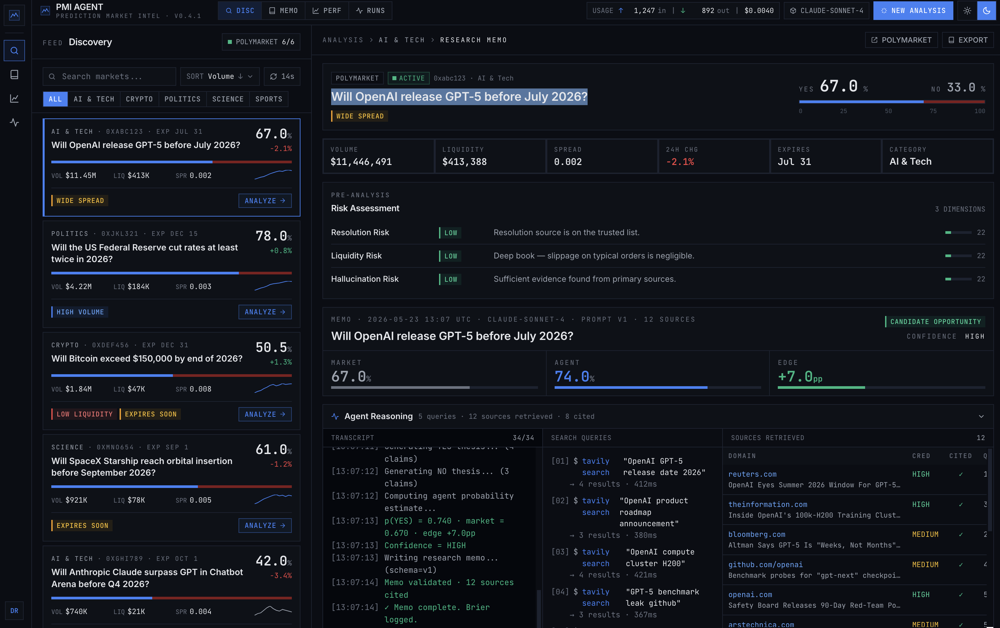

# Prediction Market Intelligence Agent

An AI agent that ingests real-time Polymarket data, retrieves external evidence,
analyzes resolution rules and liquidity risk, and generates structured research memos.

**This is decision support, not automated trading.**



## Architecture

```
Polymarket Gamma API
        ↓
  Market Ingestion
        ↓
  ┌─────────────────────────────────┐
  │         LangGraph Agent          │
  │  ┌──────────┐  ┌──────────────┐ │
  │  │  Market  │  │   Evidence   │ │
  │  │ Analyzer │  │  Retriever   │ │
  │  └──────────┘  └──────────────┘ │
  │  ┌──────────┐  ┌──────────────┐ │
  │  │   Risk   │  │    Memo      │ │
  │  │  Critic  │  │   Writer     │ │
  │  └──────────┘  └──────────────┘ │
  └─────────────────────────────────┘
        ↓
  Structured Research Memo (JSON)
        ↓
  Eval Dashboard (Brier score, citation accuracy)
```

## Memo Output Format

```json
{
  "market_question": "Will X happen by Y?",
  "current_probability": 0.37,
  "agent_estimate": 0.45,
  "edge": 0.08,
  "confidence": "medium",
  "yes_case": ["evidence 1", "evidence 2"],
  "no_case": ["counter 1", "counter 2"],
  "resolution_risk": "medium",
  "liquidity_risk": "low",
  "sources": [],
  "recommendation": "watch"
}
```

## Quick Start

```bash
uv sync
export ANTHROPIC_API_KEY="..."

# Single market memo
python main.py --market <condition_id>

# Interactive mode
python main.py --interactive

# Scan top AI/Crypto markets
python main.py --scan
```

## Eval

```bash
python eval/run_eval.py
# → citation accuracy, rule extraction, hallucination rate
```

## Safety Boundary

- No automated trade execution
- All recommendations require human confirmation
- Sources cited for every claim
- Confidence levels explicit